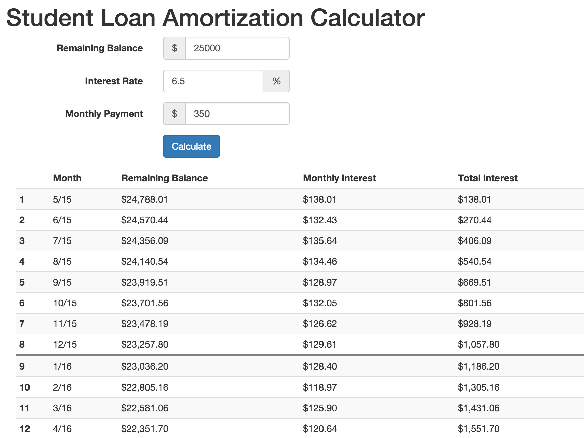

# Amortization Calculator

## [Demo](http://abrad45.github.io/amortization-calc/)

When are you going to pay off your student loan? How much could you save if you just paid $25 or $50 more a month? Arm yourself with the knowledge you need to quickly pay off your student loans with this amortization (loan payoff) calculator. All you need to know is the amount of your loan, your interest rate and your monthly payment. You can modify your monthly payment to see how much interest you'll save by paying off more quickly, or reduce your interest rate to see how a refinance would help.

If you have six loans at six different interest rates, we can help you to find your weighted average interest rate, too!

## Notes about Calculations

* Interest is calculated and compounds daily. Your exact payment date during the month is not taken into consideration. Your loan provider may calculate things slightly differently, and so these values may not be accurate for you.
* **This is for the purpose of making estimates and semi-informed financial decisions only. I'm not liable for any decisions you make, nor will I stand by any of these calculations at any time.**

## Get up and running

1. Run `npm install` (possibly `sudo npm install` depending on your setup).
1. Run `gulp`.
1. Open `index.html` in your browser and learn about your loans.

## Tech Stack

Written in [Backbone](https://github.com/jashkenas/backbone) using [Browserify](https://github.com/substack/node-browserify) and [Gulp](https://github.com/gulpjs/gulp).
